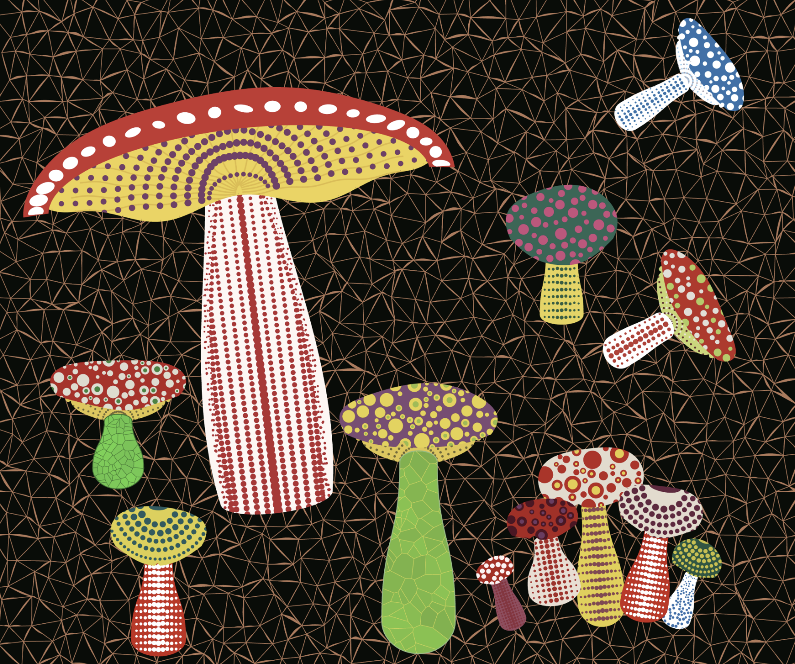

# yzha0190_GroupA_JenZHANG_IndividualTask
 Audio-Reactive Toadstools | Individual Functioning Prototype
 Tut 2, Group A, Audio part, Jen ZHANG (yzha0190)

# 1.Interaction Instructions

Click the “🎵” button to start the audio track.

Once the audio begins, the entire composition becomes reactive:
- The mushroom scales up and down according to amplitude.
- The stem deforms in an S-shaped motion based on bass energy.
- The red dots on the stem change size and opacity depending on amplitude.
- The background changes colour according to treble energy.

# 2.Individual Approach Detail
## 2.1 I chose audio to drive my individual code.
This repository contains my individual functional prototype based on our group’s artwork result.

## 2.2 Unique Animated Visual Properties
In my individual version, the animation focuses on global audio responsiveness rather than user interaction. I animate three key properties of the visual composition:

- Global Scale Variation (Amplitude-Driven Breathing Effect)
Both the mushroom cap and stem scale together based on sound amplitude. This creates a smooth breathing motion, as if the mushrooms inhale and exhale with the rhythm of the music.

- Stem Deformation (Bass-Driven S-Curve Wobble)
The stem’s horizontal curvature is modulated by a sine-wave function whose strength corresponds to bass energy. Strong bass results in more dramatic wobbling, making the mushrooms visually “dance.”

- Dynamic Background Brightness (Treble-Responsive Atmosphere)
The triangular background brightness is mapped to treble energy. Higher frequencies increase overall lightness, enhancing immersion and giving the scene a more vibrant and reactive mood.

## 2.3 Design Inspiration

### 2.3.1 Organic structures
Yayoi Kusama's mushrooms are characterized by their soft, slightly exaggerated shapes and repetitive dots. Therefore, in the animation, I gave the caps a slightly natural distortion and the dots a subtle, random tremor to create a sense of organic life.

At the same time, I wanted the mushrooms to be lively and rhythmic, like a musical performance group, similar to some fun mushroom animations online. 

[Eat Your Vegetables Rap Song Vocal Music](https://www.youtube.com/watch?v=ep5-w-UFIHI). This reference comes from some fun mushroom animations online where vegetables dance or play instruments.

### 2.3.2 The audio track 
I used the song Pueblo Mágico by Quincas Moreira for my audio input.
[Pueblo Magic by Quincas Moreira](https://www.youtube.com/watch?v=RWRI6xUi7A0) has a gentle rhythm and clear layers, which makes the mushroom’s movements feel more organic. The bass drives the stem’s wobble, the mid-range affects the breathing motion, and the higher frequencies make the background colours shift.

## 2.4 Technical explanation
I did not make major structural changes to the group code. The existing geometry system, dot patterns, and Voronoi stem textures remain intact. My changes mainly extend the behaviour inside the update and drawing functions so each mushroom receives the audio values and animates in response.

Amplitude controls the global scale of each mushroom, so they appear to expand and contract like breathing.

Bass energy extracted from the FFT drives the wobble of the stems, creating an S-shaped dancing movement that reacts to strong beats.

Treble energy influences the brightness of the background, causing subtle glowing changes when higher frequencies become more prominent.

This transforms the static group illustration into a performance-like scene that reacts continuously to music.

The p5.sound audio analysis features (Amplitude and FFT) are part of the p5.js library, but using them for this level of visual animation required learning beyond the basic usage taught in class. I referred to the official documentation to understand how to extract bass and treble values for controlling different visual components.

Our group code also uses a Voronoi pattern system which relies on two external libraries not covered in the course content. I did not modify or implement these algorithms myself; I simply continued using them as part of the existing design.

Voronoi libraries used:

Javascript-Voronoi by Raymond Hill — https://github.com/gorhill/Javascript-Voronoi

p5.voronoi by Francisco Moreira — https://github.com/Dozed12/p5.voronoi
Support and AI-assisted learning

I also used ChatGPT as a learning and debugging tool during development. It helped me understand how to apply amplitude and FFT values from the p5.sound library to visual animation. I did not copy large portions of code directly. Instead, I asked questions, reviewed the suggestions, and then integrated and modified the logic myself to fit our group structure.

This support mainly helped me with:

Passing audio data into each mushroom instance

Mapping different frequency ranges to different animation properties

Fixing small errors when combining sound analysis with our existing update functions

By using AI in this way, I was able to learn faster and maintain full understanding and control over the final code.

Reference:

[p5.Amplitude/getLevel](https://p5js.org/reference/p5.AudioIn/getLevel/)

[p5.Amplitude](https://p5js.org/reference/p5.sound/p5.Amplitude/)

amp = new p5.Amplitude();
currentLevel = amp.getLevel();

The amplitude level (0–1) is mapped to a scale range, producing the breathing effect.
Amplitude also controls dot opacity and diameter.

## 6.2 FFT bass energy driving stem deformation
Reference:

[p5.FFT](https://p5js.org/reference/p5.sound/p5.FFT/)

[p5.FFT/getEnergy](https://p5js.org/reference/p5.FFT/getEnergy/)

Low-frequency energy is extracted using:
fft = new p5.FFT();
lowEnergy = fft.getEnergy("bass");

The stem’s x-coordinates are modified using a sinusoidal function:
x = originalX + sin(phase + norm * frequency) * strength;

The deformation strength is proportional to bass intensity, creating soft-body motion.

## 6.3 Treble energy controlling background colour
Reference:

[p5/lerpColor](https://p5js.org/reference/p5/lerpColor/)

The background triangle mesh interpolates between warm and cool tones using:

triangleColor = lerpColor(warmCol, coolCol, t);

The interpolation factor is derived from the difference between high and low frequency energy.

## 6.4 Perlin noise for cap dot variation
Reference:

[p5/noise](https://p5js.org/reference/p5/noise/)

Perlin noise introduces natural variability to dot sizes:

d = baseSize * (1 + 0.14 * noise(r, k));

This avoids mechanical repetition and adds organic texture.

## 6.5 Custom shapes using parametric sampling
Reference:

[p5/beginShape/](https://p5js.org/reference/p5/beginShape/)

Both stem and cap outlines are drawn using:

beginShape();

vertex(...);

endShape(CLOSE);

This allows precise control of mushroom curvature, sagging geometry, and clipped shading regions.

# 3. References
## 3.1 p5.js Sound Library

  - p5.js. “p5.Amplitude.” p5.js Reference. [p5.Amplitude](https://p5js.org/reference/p5.sound/p5.Amplitude/)

  - p5.js. “p5.FFT.” p5.js Reference. [//p5js.org/reference/#/p5.FFT](https://p5js.org/reference/p5.sound/p5.FFT/)

  - p5.js. “getEnergy().” p5.js Reference. [https://p5js.org/reference/#/p5.FFT/getEnergy](https://p5js.org/reference/p5.FFT/getEnergy/)

  - p5.js. “userStartAudio().” [https://p5js.org/reference/#/p5/userStartAudio](https://p5js.org/reference/p5/userStartAudio/)

## 3.2 p5.js Core

    -  p5.js. “noise().”p5.js Reference. [p5.js. “noise().”](https://p5js.org/reference/p5/noise/)

    -  p5.js. “beginShape().”p5.js Reference.[p5.js. “beginShape().”](https://p5js.org/reference/p5/beginShape/)

    -  p5.js. “vertex().”p5.js Reference.[p5.js. “vertex().”](https://p5js.org/reference/p5/vertex/)
   
    -  p5.js. “endShape().”p5.js Reference.[p5.js. “endShape().”](https://p5js.org/reference/p5/beginShape/)
      
    -  p5.js. “lerpColor().”p5.js Reference.[p5.js. “lerpColor().”](https://p5js.org/reference/p5/lerpColor/)
      
    -  p5.js. “map().”p5.js Reference.[p5.js. “map().”](https://p5js.org/reference/p5/map/)
      
    -  p5.js. “sin().”p5.js Reference.[p5.js. “sin().”](https://p5js.org/reference/p5/sin/)

## 3.3 External Technical References

- [MDN Web Docs. “CanvasRenderingContext2D.clip.”](https://developer.mozilla.org/en-US/docs/Web/API/CanvasRenderingContext2D/clip)

- [MDN Web Docs. “addEventListener.”](https://developer.mozilla.org/en-US/docs/Web/API/EventTarget/addEventListener)
